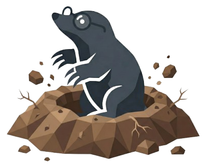

<a id="readme-top"></a>

<!-- PROJECT SHIELDS -->
[![Contributors][contributors-shield]][contributors-url]
[![Forks][forks-shield]][forks-url]
[![Stargazers][stars-shield]][stars-url]
[![Issues][issues-shield]][issues-url]
[![MIT License][license-shield]][license-url]


<!-- PROJECT LOGO -->
<br />
<div align="center">
  <a href="https://github.com/RaymonDev/soil">
    
  </a>

  <h1>Soil</h1>

  <p align="center">
    <strong>Open-source desktop LaTeX editor with offline two-way Overleaf sync.</strong>
    <br />
    Write, compile, and preview LaTeX documents locally — while staying in sync with your Overleaf projects through Git.
    <br />
    No Perl. No TeX Live installation. No fuss. Everything downloads automatically.
    <br />
    <br />
    <a href="https://github.com/RaymonDev/soil/releases"><strong>Download Latest Release »</strong></a>
    <br />
    <br />
    <a href="https://github.com/RaymonDev/soil/issues/new?labels=bug&template=bug-report---.md">Report Bug</a>
    &middot;
    <a href="https://github.com/RaymonDev/soil/issues/new?labels=enhancement&template=feature-request---.md">Request Feature</a>
  </p>
</div>


<!-- TABLE OF CONTENTS -->
<details>
  <summary>Table of Contents</summary>
  <ol>
    <li>
      <a href="#about-the-project">About The Project</a>
      <ul>
        <li><a href="#built-with">Built With</a></li>
      </ul>
    </li>
    <li><a href="#features">Features</a></li>
    <li>
      <a href="#getting-started">Getting Started</a>
      <ul>
        <li><a href="#prerequisites">Prerequisites</a></li>
        <li><a href="#installation">Installation</a></li>
        <li><a href="#build-distributable">Build Distributable</a></li>
      </ul>
    </li>
    <li><a href="#keyboard-shortcuts">Keyboard Shortcuts</a></li>
    <li><a href="#contributing">Contributing</a></li>
    <li><a href="#license">License</a></li>
  </ol>
</details>


<!-- ABOUT THE PROJECT -->
## About The Project

<!-- [![Soil Screenshot][product-screenshot]](https://github.com/RaymonDev/soil) -->

Soil is a self-contained Electron app built for academics, students, and anyone who writes in LaTeX. Most LaTeX workflows either force you into a browser (Overleaf) or require a heavyweight local TeX installation. Soil sits in the middle:

* **Edit locally** with a proper code editor (Monaco — the same engine behind VS Code)
* **Compile locally** with an auto-downloaded TinyTeX — no system-wide install required
* **Sync with Overleaf** through Git so you and your collaborators stay on the same page
* **Work offline** and push when you're back online — nothing is ever lost

Everything you need downloads automatically on first launch. Open the app and start writing.

<p align="right">(<a href="#readme-top">back to top</a>)</p>


### Built With

* [![Electron][Electron-badge]][Electron-url]
* [![Monaco][Monaco-badge]][Monaco-url]
* [![PDF.js][PDFjs-badge]][PDFjs-url]
* [![Node.js][Node-badge]][Node-url]

<p align="right">(<a href="#readme-top">back to top</a>)</p>


<!-- FEATURES -->
## Features

### Overleaf Integration
- **One-click sign-in** — secure browser window with reCAPTCHA, SSO, and 2FA support. Session persists across restarts.
- **Project browser** — all your Overleaf projects sorted by last updated, with instant search and smart local-clone detection.
- **Clone any project** — from the browser or by pasting a raw `git.overleaf.com` URL.
- **Push + Commit** — confirmation dialog shows every changed file before syncing back.
- **Pull** — fetch the latest version from Overleaf with one click.

### Zero-Dependency Setup
- **Auto-downloads TinyTeX** (TeX Live 2026) on first launch — no system-wide TeX installation needed.
- **Auto-downloads MinGit** — portable Git binary, no `git` on PATH required.
- Everything lives in `%APPDATA%\Soil\tools\`, fully self-contained.
- Progress bar on first launch; retry button on failure.

### LaTeX Compilation
- **Local `pdflatex`** — no Perl or `latexmk` dependency.
- **Automatic package installation** — missing `.sty` / `.cls` files resolved and installed via `tlmgr` with up to 5 cascading install rounds.
- **Multi-mirror fallback** — TeX Live 2026 repo with German mirror primary, CTAN fallback.
- Runs with `-interaction=nonstopmode` (Overleaf-compatible).

### Editor
- **Monaco Editor** with full LaTeX syntax highlighting (commands, math, comments, brackets).
- **Auto-compile**: Off / Normal (5 s) / Fast (1.5 s) debounce modes.
- **Error & warning decorations** — wavy underlines, glyph dots, minimap highlights, hover messages.
- **Git gutter indicators** — green (added), blue (modified), red (deleted) bars matching VS Code conventions.
- Bracket pair colourisation and word wrap enabled by default.

### File Management
- Sidebar file tree with active-file highlighting.
- Create, upload, and download files through native dialogs.
- Recognises `.tex`, `.bib`, `.sty`, `.cls`, and common image formats.

### PDF Preview
- Live PDF preview powered by **PDF.js**, rendered on canvas.
- Page navigation, zoom controls, auto-reload after compile.

### Offline Mode
- **Automatic network detection** — DNS probe every 10 seconds.
- **Offline banner** with unpushed commit count.
- **Local commits** when offline — no work is lost.
- **Back-online sync dialog** — one-click push on reconnect.

### Settings & Customisation
- **Light / Dark / System** theme toggle with warm neutral palette.
- **Settings panel** — manage Git tokens (view masked, change, delete).
- **Recent projects** quick access on the welcome screen.
- **Reset all data** — factory reset with double confirmation (red danger zone).

### Build-Artifact Safety
- Compilation output (`.aux`, `.log`, `.pdf`, etc.) excluded from the file watcher.
- Push pauses auto-compile and auto-commits straggler build artifacts to avoid rebase conflicts.

<p align="right">(<a href="#readme-top">back to top</a>)</p>


<!-- GETTING STARTED -->
## Getting Started

Get Soil running locally in under a minute.

### Prerequisites

* **Node.js** ≥ 18 and **npm**
* An **Overleaf Premium** account (for Git sync — local-only editing works without one)

### Installation

1. Clone the repo
   ```sh
   git clone https://github.com/RaymonDev/soil.git
   ```
2. Install dependencies
   ```sh
   cd soil
   npm install
   ```
3. Run the app
   ```sh
   npm start
   ```

On first launch Soil will download **TinyTeX** (~90 MB) and **MinGit** (~50 MB). This only happens once.

### Build Distributable

```sh
npm run dist          # current platform
npm run dist:win      # Windows (NSIS installer)
npm run dist:mac      # macOS (DMG)
npm run dist:linux    # Linux (AppImage)
```

Output goes to `release/`.

<p align="right">(<a href="#readme-top">back to top</a>)</p>


<!-- KEYBOARD SHORTCUTS -->
## Keyboard Shortcuts

| Shortcut | Action |
|---|---|
| `Ctrl + S` | Save current file to disk |
| `Ctrl + B` | Compile LaTeX |
| `Ctrl + Shift + S` | Push + Commit to Overleaf |

<p align="right">(<a href="#readme-top">back to top</a>)</p>


<!-- CONTRIBUTING -->
## Contributing

Contributions are what make the open-source community such an amazing place to learn, inspire, and create. Any contributions you make are **greatly appreciated**.

<p align="right">(<a href="#readme-top">back to top</a>)</p>


<!-- LICENSE -->
## License

Distributed under the **MIT License**. See `LICENSE` for more information.

<p align="right">(<a href="#readme-top">back to top</a>)</p>


<!-- MARKDOWN LINKS & IMAGES -->
[contributors-shield]: https://img.shields.io/github/contributors/RaymonDev/soil.svg?style=for-the-badge&v=1
[contributors-url]: https://github.com/RaymonDev/soil/graphs/contributors
[forks-shield]: https://img.shields.io/github/forks/RaymonDev/soil.svg?style=for-the-badge&v=1
[forks-url]: https://github.com/RaymonDev/soil/network/members
[stars-shield]: https://img.shields.io/github/stars/RaymonDev/soil.svg?style=for-the-badge&v=1
[stars-url]: https://github.com/RaymonDev/soil/stargazers
[issues-shield]: https://img.shields.io/github/issues/RaymonDev/soil.svg?style=for-the-badge&v=1
[issues-url]: https://github.com/RaymonDev/soil/issues
[license-shield]: https://img.shields.io/github/license/RaymonDev/soil.svg?style=for-the-badge&v=1
[license-url]: https://github.com/RaymonDev/soil/blob/main/LICENSE
[Electron-badge]: https://img.shields.io/badge/Electron-47848F?style=for-the-badge&logo=electron&logoColor=white
[Electron-url]: https://www.electronjs.org/
[Monaco-badge]: https://img.shields.io/badge/Monaco_Editor-007ACC?style=for-the-badge&logo=visualstudiocode&logoColor=white
[Monaco-url]: https://microsoft.github.io/monaco-editor/
[PDFjs-badge]: https://img.shields.io/badge/PDF.js-FF3E00?style=for-the-badge&logo=mozilla&logoColor=white
[PDFjs-url]: https://mozilla.github.io/pdf.js/
[Node-badge]: https://img.shields.io/badge/Node.js-339933?style=for-the-badge&logo=nodedotjs&logoColor=white
[Node-url]: https://nodejs.org/
